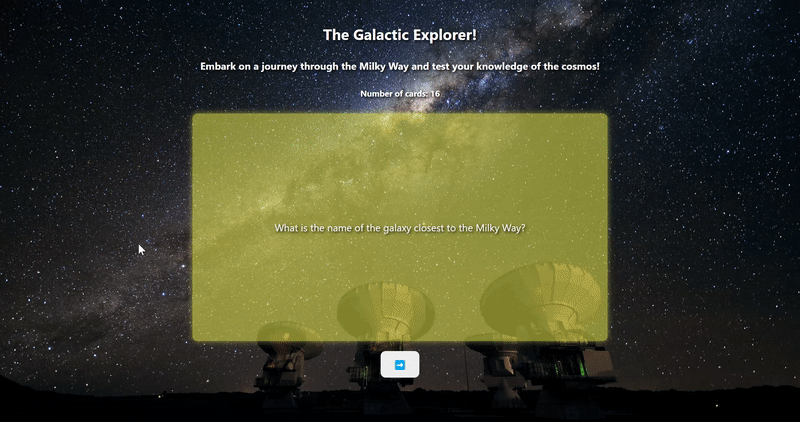

# Web Development Project 2 - Space Flashcards!

Submitted by: **Jawad Chowdhury**

This web app: **lets users learn about space through the use of flash cards.**

Time spent: **4.5** hours spent in total

## Required Features

The following **required** functionality is completed:

- [X] **The title of the card set and some information about it, such as a short description and the total number of cards are displayed**
- [X] **A single card at a time is displayed, only showing one of the components of the information pair**
- [X] **A list of card pairs is created**
- [X] **Clicking on the card shows the corresponding component of the information pair**
- [X] **Clicking the next button displays a random new card**

The following **optional** features are implemented:

- [X] Cards contains images in addition to or in place of text
- [X] Cards have different visual styles such as color based on their category
  - [X] Colors based on difficulty. Hard - Red, Medium - Yellow, Easy - Green.

The following **additional** features are implemented:

* [ ] List anything else that you added to improve the site's functionality!

## Video Walkthrough

Here's a walkthrough of implemented required features:

<!-- Replace this with whatever GIF tool you used! -->
GIF created with ShareX
<!-- Recommended tools:
[Kap](https://getkap.co/) for macOS
[ScreenToGif](https://www.screentogif.com/) for Windows
[peek](https://github.com/phw/peek) for Linux. -->

## Notes

I had a bit of issues with a specific function in App.jsx that was meant to goto a random card each time the user clicked the next button. I think the way I did it works fine, but is convoluted. An easier route would have been to just shuffle the flashcards array at the start, and then just iterate through it. That would've been more efficient as well. Also I wanted to make it so that every time the user clicked the card it would flip, but ran into issues with the image of specific cards being messed up, and then text just not appearing on the backside of a card randomly. I'll try to see why these issues occured later down the line.

## License

    Copyright 2023 Jawad Chowdhury

    Licensed under the Apache License, Version 2.0 (the "License");
    you may not use this file except in compliance with the License.
    You may obtain a copy of the License at

        http://www.apache.org/licenses/LICENSE-2.0

    Unless required by applicable law or agreed to in writing, software
    distributed under the License is distributed on an "AS IS" BASIS,
    WITHOUT WARRANTIES OR CONDITIONS OF ANY KIND, either express or implied.
    See the License for the specific language governing permissions and
    limitations under the License.
